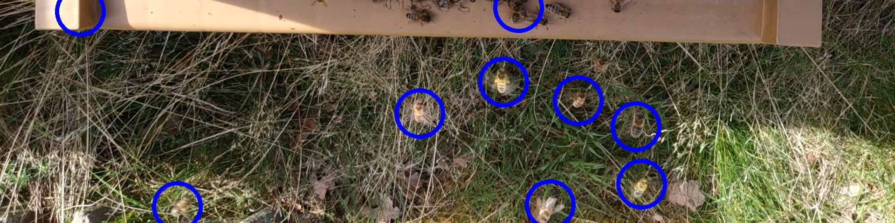

# High performance bees tracking solution

## How to use the solution

This project contains 2 targets:
- `example.cpp`: an simple example program which run the solution
- `benchmarks.cpp`: target used to run benchmarks and obtain metrics on performance

The example input data for both target can be downloaded and extracted using the dedicated script:
```
cd data
bash data/download_data.sh
```
Please contact me if you can't download the file


## How to compile and use the example target

```
mkdir build && cd build
cmake ..
make -j example
./example
```

Without any debug information, the example program generates a metadata file which contains all the parameters used in the run, as well as the output statistics

## How to compile and use the benchmark target

Please take care that ENABLE_PERFORMANCE_LOG in implementation/Inc/Parameters.hpp is set to true at this point.

```
mkdir build && cd build
cmake -DCMAKE_BUILD_TYPE=Release ..
make -j benchmarks
./benchmarks
```

The benchmarking process may take a few minutes. Then the performance metrics are generated in ./eval
The graphsGenerator.py python script can be used to generate plots from these metrics.


## Debug levels

Debug options can be modified by changing `DEBUG_FLAGS` in `implementation/Inc/Parameters.hpp`
The following options are available:
-  `logBees`: log bees in a csv file
-  `logTrajectories`: log bee trajectories in a csv file
-  `generateOutputFrames`: draw circle around the detected bees on each of the input frames
-  `generateBeeImages`: generate small jpeg image for each recognized bee. After manual labelling, this can be used to train a machine learning algorithm, which may be used to improve accuracy.
-  `generateIntermediateImages`: generate the intermediate states (T0, T1...) of the image processing algorithm

## Generate Doxygen documentation
A Doxygen documentation can be generated using the following commands:
```
cmake ..
make doxygen
```
The output will be generated in `documentation/doxygen/doc`



## Bibliography 

The solution implemented in this project is mainly inspired from the following papers:

- Baptiste Magnier, Ga ̈etan Ekszterowicz, Joseph Laurent, Matthias Rival, Fran ̧cois Pfister. Bee
  hive traffic monitoring by tracking bee flight paths. 13th International Joint Conference on
  Computer Vision, Imaging and Computer Graphics Theory and Applications, January 27-29,
  2018, in Funchal, Madeira, Portugal, pp.563-571, 2018, 10.5220/0006628205630571. hal-01940300
  https://hal.science/hal-01940300/document
- Baptiste Magnier, Eliyahou Gabbay, Faysal Bougamale, Behrang Moradi,  François Pfister, et al.. Multiple honey bees tracking and trajectory  modeling. *Multimodal Sensing and Artificial Intelligence: Technologies and Applications*, Jun 2019, Munich, France. pp.29, [⟨10.1117/12.2526120⟩](https://dx.doi.org/10.1117/12.2526120). [⟨hal-02187412⟩](https://hal.science/hal-02187412)

This project has started as a freestyle exercise during the "Efficient parallel C++" lab course at [Karlsruher Institut für Technologie.](https://www.kit.edu/) I would like to thank in particular the supervisors of this course.
